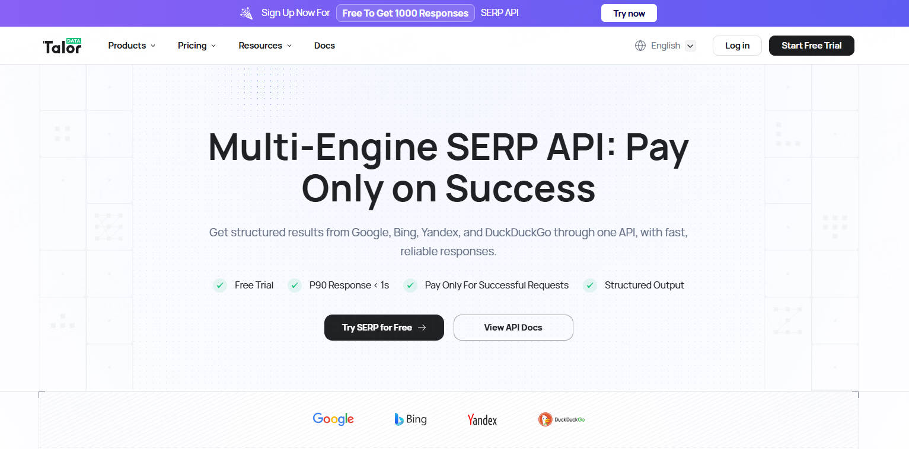

  

<h1 align="center">TalorData</h1>

  <strong>Multi-Engine SERP API for Developers, SEO Teams, and AI Workflows</strong>

  Real-time search data from Google, Bing, Yandex, and DuckDuckGo — built for AI agents, SEO platforms, and large-scale search applications.

---

## 🚀 What is TalorData?

TalorData provides fast, reliable, and structured search results through a unified SERP API.

Built for developers, AI teams, and enterprise search applications, TalorData helps you access real-time search data at scale while maintaining low latency, high reliability, and global coverage.

### Key Benefits

- ⚡ Real-time search results
- 🌎 Coverage across 195+ countries
- 🤖 Optimized for AI Agents and RAG workflows
- 🔍 Multi-engine support
- 📈 Enterprise-grade reliability
- 💰 Cost-efficient at scale

---

## 📄 Featured Research

### Benchmark Report v1

A detailed comparison of **TalorData**, **SerpAPI**, and **DataForSEO** across key performance metrics.

#### Highlights

- **Latency:** Average response time under 3 seconds
- **Success Rate:** Above 99.9%
- **Cost Efficiency:** Optimized for high-volume usage
- **Global Coverage:** 195+ countries and regions

➡️ [Read the Full Report](https://talordata.com/?campaignid=hiy46bmdwF990Hqs&utm_source=Github29&utm_term=Github29)

---

## 🔌 Products & Integrations

| Product | Description |
|----------|-------------|
| **SERP API** | Real-time structured search results from multiple search engines |
| **MCP Server** | Search capabilities for AI agents via MCP |
| **LangChain SDK** | Fast integration with LangChain applications |
| **LlamaIndex Examples** | Reference implementations for AI workflows |

---

## 📊 Platform Highlights

| Metric | Value |
|---------|---------|
| Uptime | 99.9% |
| Average Response Time | < 1s |
| Global Coverage | 195+ Countries |
| Support Availability | 24/7 |
| Search Engines Supported | Google, Bing, Yandex, DuckDuckGo |

---

## ⭐ Featured Repositories

### SERP API

High-performance search API infrastructure.

- https://github.com/Talordata/talordata-serp

### MCP Server

Model Context Protocol integration for AI agents.

- [https://github.com/Talordata/talordata-mcp](https://github.com/Talordata/talordata-mcp)

### LangChain SDK

Official LangChain integration.

- [https://github.com/Talordata/langchain-talordata](https://github.com/Talordata/langchain-talordata)

---

## 🔗 Resources

- 🌐 Website: https://talordata.com
- 📖 Documentation: https://docs.talordata.com
- 💻 GitHub Organization: https://github.com/Talordata
- 📧 Support: support@talordata.com

---

## 🎯 Use Cases

### AI Agents

Enable agents to access real-time information from search engines.

### SEO Platforms

Collect and analyze SERP data at scale.

### Market Intelligence

Monitor competitors, rankings, and search visibility.

### RAG & LLM Applications

Provide fresh web context for AI-powered systems.

---

## 🎁 Get Started for Free

Try TalorData SERP API with **1,000 free searches** and start building AI agents, SEO tools, and search-driven applications today.

- No infrastructure to manage
- Multi-engine search access
- Real-time structured results
- Developer-friendly integration

👉 [Start Free](https://talordata.com/?campaignid=hiy46bmdwF990Hqs&utm_source=Github29&utm_term=Github29)

---

## 🤝 Connect With Us

Have questions or want to collaborate? Reach out through any of the following channels:

- 📧 **Email:** [support@talordata.com](mailto:support@talordata.com)  
- 🌐 **Website:** [https://talordata.com](	https://talordata.com/?campaignid=hiy46bmdwF990Hqs&utm_source=Github29&utm_term=Github29)   
- 📱 **WhatsApp:** [+852 5628 3471](https://wa.me/85256283471)  
- 💼 **LinkedIn:** [TalorData](linkedin.com/company/talordata)

---

> **TalorData empowers developers and AI agents with fast, reliable search-data access through a single multi-engine SERP API.**
